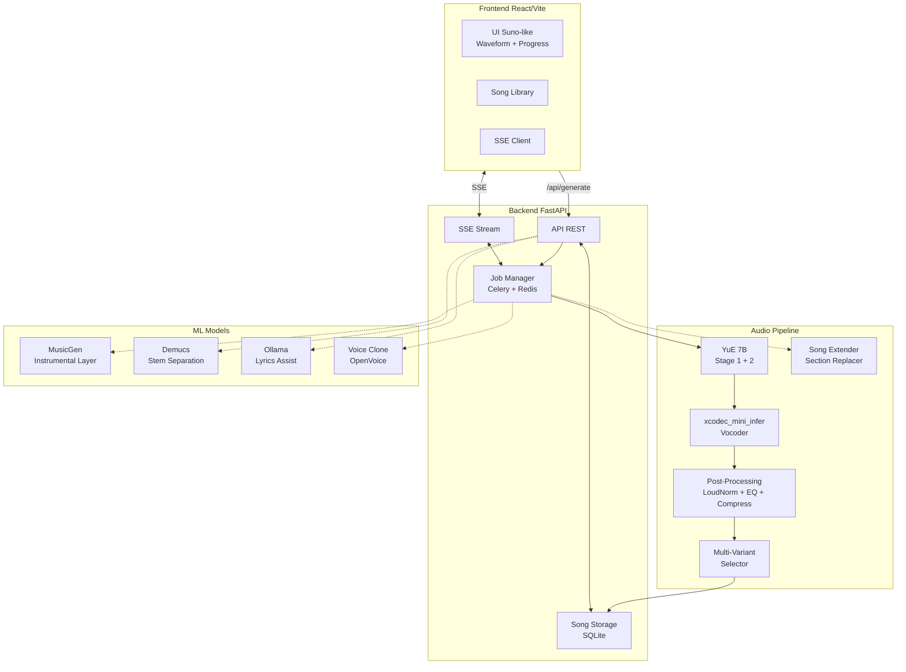

# 🚀 Roadmap: DocuMusic → Nivel Suno AI / MusicGPT

## Estado Actual
- YuE 7B corriendo en RTX 5080 (16GB VRAM)
- Pipeline básico: letra → infer.py → MP3
- Frontend funcional pero básico
- Sin post-processing de audio

## Fases del Plan

---

## 🔵 FASE 0: Optimización del Pipeline Actual (Inmediato)

### 0.1 Mejores parámetros de inferencia de YuE
Actualmente usamos parámetros por defecto. YuE soporta muchos más:

| Parámetro | Actual | Propuesto | Efecto |
|-----------|--------|-----------|--------|
| `--max_new_tokens` | 3000 | 4096-6144 | Canciones más largas (60s → 90s+) |
| `--run_n_segments` | 2 | 3-4 | Más segmentos = mejor estructura |
| `--cfg_scale` | default | 3.5 | Mejor adherencia al style prompt |
| `--temperature` | default | 1.0-1.2 | Más creatividad/variedad |
| `--top_p` | default | 0.92 | Equilibrio calidad/diversidad |
| `--top_k` | default | 50 | Reduce artefactos |
| `--repetition_penalty` | default | 1.1 | Evita loops repetitivos |

**Archivos a modificar:**
- [`backend/main.py`](../backend/main.py:275) — Comando `cmd[]` en `run_yue_inference()`

### 0.2 Generación de Múltiples Variantes (Best-of-N)
- Generar 2-3 variantes en paralelo (o secuencial)
- Usar diferentes semillas automáticas
- Seleccionar la mejor (basado en métricas simples: duración, volumen RMS)
- Ofrecer las 3 al usuario para que elija

**Archivos a modificar:**
- [`backend/main.py`](../backend/main.py:254) — `run_yue_inference()` → aceptar `num_variants`
- [`backend/main.py`](../backend/main.py:180) — Endpoint `/api/generate` → parámetro `variants`

### 0.3 Post-Procesamiento de Audio (Pipeline de Masterización)
Pipeline FFmpeg en cadena:

```
Raw MP3 → LoudNorm → EQ → Compression → StereoWiden → Fade → Final MP3
```

Detalle de cada etapa:

**a) Loudness Normalization (LUFS)**
- Objetivo: -14 LUFS (estándar Spotify/YouTube Music)
- Usar `loudnorm` filter de FFmpeg
- Medir LUFS actual, aplicar ganancia

**b) EQ Suave**
- Cortar frecuencias sub-bajo (<40Hz) que generan ruido
- Ligero boost a presencia vocal (2-4kHz)
- High-shelf suave para claridad

**c) Compresión Multibanda**
- Controlar picos transientes
- Nivelar dinámica entre verso/coro
- Ratio suave (2:1 a 3:1)

**d) Stereo Enhancement**
- Widening sutil (~15-25%)
- Correlación estéreo monitoreada

**e) Fade in/out**
- Fade in: 500ms
- Fade out: 2s

**Archivos nuevos:**
- [`backend/audio_master.py`](../backend/audio_master.py) — Pipeline completo

### 0.4 Detección y Reducción de Artefactos
- Detectar clipping (samples > 0dB)
- Aplicar soft limiter
- Noise gate para silencios
- De-esser para voces sibilantes

---

## 🟡 FASE 1: Modelos Complementarios

### 1.1 Integrar MusicGen (Meta) como segundas voces / capas
- MusicGen es más pequeño (1.5B-3.3B) y rápido
- Puede generar armonías, instrumentales de respaldo
- Usar como "capa de instrumentación" combinada con YuE

**Estrategia:**
1. YuE genera voz principal + estructura
2. MusicGen genera instrumental complementario
3. Mezclar ambas con FFmpeg (`amix` filter)

### 1.2 Implementar Song Extender (como Suno)
- Tomar últimos N segundos de canción generada
- Usar como "prompt de audio" para generar continuación
- Concatenar con crossfade

Técnica:
```
Canción original [0:00-1:30] → Cortar últimos 15s → 
Usar como seed para nueva generación → Crossfade → 
Canción extendida [0:00-2:45]
```

### 1.3 Section Replacement (Cover parcial)
- Reemplazar solo el coro manteniendo versos
- Generar nueva sección con estilo diferente
- Stitch con crossfade

---

## 🟠 FASE 2: UI/UX Tipo Suno AI

### 2.1 Waveform Visualizer
- Componente React que renderiza forma de onda
- Colores dinámicos que cambian con la música
- Click-to-seek en la waveform

**Librería:** `wavesurfer.js` o custom Canvas API

### 2.2 Song Structure Timeline
- Visualizar estructura: [Intro] [Verse] [Chorus] [Bridge] [Outro]
- Colores diferentes por sección
- Posibilidad de hacer clic para ir a cada sección

### 2.3 Generation Progress Panel
- Reemplazar logs técnicos por indicadores visuales:
  - ⚡ Stage 1 (Token Generation) → 45%
  - 🎨 Stage 2 (Audio Decoding) → 75%
  - 🎚 Mastering → 95%
  - ✅ Complete → 100%
- Tiempo estimado restante
- Animaciones suaves

### 2.4 Multiple Variants Display
- Grid de 2-3 cards con variantes
- Cada card: mini player + duración + estilo detectado
- Botón "Elegir esta" que expande a visor completo

### 2.5 Song Library / History
- Grid de canciones generadas
- Thumbnail con waveform miniatura
- Búsqueda por estilo/letra
- Favoritos y descarga directa

**Archivos nuevos:**
- [`frontend/src/SongLibrary.jsx`](../frontend/src/SongLibrary.jsx)
- [`frontend/src/WaveformPlayer.jsx`](../frontend/src/WaveformPlayer.jsx)
- [`frontend/src/GenerationProgress.jsx`](../frontend/src/GenerationProgress.jsx)
- [`backend/song_storage.py`](../backend/song_storage.py) — DB SQLite ligera

### 2.6 Modo Oscuro / Tema Suno-like
- Paleta de colores inspirada en Suno
- Animaciones fluidas
- Micro-interacciones (hover, click, transitions)
- Diseño responsive

---

## 🔴 FASE 3: Arquitectura y Rendimiento

### 3.1 Job Queue con Celery + Redis
- Actualmente: `BackgroundTasks` de FastAPI (en memoria, no persiste)
- Propuesto: Celery workers con Redis como broker
- Ventajas: persistencia, reintentos, concurrencia, monitoreo

**Flujo nuevo:**
```
Frontend → POST /api/generate → Celery Task → Redis Queue → 
Worker (GPU) → Post-process → Redis Result → Frontend polls
```

### 3.2 Result Streaming (Server-Sent Events)
- En lugar de polling cada 1.5s
- Conexión SSE persistente
- Actualizaciones en tiempo real sin latencia

**Endpoint:** `GET /api/stream/{job_id}`

### 3.3 Model Hot-Swapping
- Cargar/descargar modelos según demanda
- Múltiples workers en el mismo GPU con MPS (MIG no disponible en RTX)
- O usar cola FIFO: un modelo a la vez, cola de requests

### 3.4 Caching de Modelos
- Mantener YuE en VRAM entre requests (ya se hace)
- Cache de xcodec en RAM
- Warm-start del pipeline

---

## 🟣 FASE 4: Experiencia Suno AI

### 4.1 "Reimagine" / Cover Mode
- Tomar una canción existente y regenerar en nuevo estilo
- Preservar melodía vocal, cambiar instrumentación

### 4.2 "Custom Voice" / Voice Cloning
- Usar modelos como Coqui TTS o OpenVoice
- Clonar voz del usuario
- Generar canciones con esa voz clonada

### 4.3 Lyrics Generation Assistida por LLM
- Usar Ollama (ya instalado) para generar letras
- Sugerir estructuras de canción
- Auto-completar versos/coro basado en tema

### 4.4 Export Options
- MP3 (192kbps, 320kbps)
- WAV (44.1kHz, 48kHz)
- Stem separation (voz/instrumental separados) con Demucs
- MIDI export (conversión básica)

---

## Diagrama de Arquitectura Propuesta



## Priorización para Implementación

| Prioridad | Fase | Item | Impacto | Esfuerzo |
|-----------|------|------|---------|----------|
| 🔴 P0 | 0.1 | Mejores parámetros YuE | Alto | Bajo |
| 🔴 P0 | 0.3 | Pipeline post-processing (masterización) | Alto | Medio |
| 🔴 P0 | 0.2 | Múltiples variantes (best-of-N) | Alto | Bajo |
| 🟡 P1 | 2.1 | Waveform visualizer | Medio | Medio |
| 🟡 P1 | 2.3 | Progress panel visual | Medio | Bajo |
| 🟡 P1 | 2.5 | Song Library | Medio | Alto |
| 🟡 P1 | 1.2 | Song Extender | Alto | Alto |
| 🟢 P2 | 3.1 | Celery + Redis | Medio | Alto |
| 🟢 P2 | 2.2 | Structure Timeline | Bajo | Medio |
| 🟢 P2 | 1.1 | MusicGen integration | Alto | Muy Alto |
| 🔵 P3 | 4.1 | Reimagine mode | Medio | Alto |
| 🔵 P3 | 4.2 | Voice Cloning | Alto | Muy Alto |
| 🔵 P3 | 4.3 | LLM Lyrics Assist | Medio | Bajo |
| 🔵 P3 | 4.4 | Stem Export | Medio | Alto |

---

## Archivos a Crear/Modificar por Fase

### Fase 0
- [`backend/main.py`](../backend/main.py) — Parámetros, variantes, seeds
- [`backend/audio_master.py`](../backend/audio_master.py) — **NUEVO**: Pipeline FFmpeg
- [`backend/requirements.txt`](../backend/requirements.txt) — +`pyloudnorm` si usamos Python

### Fase 1
- [`backend/musicgen_bridge.py`](../backend/musicgen_bridge.py) — **NUEVO**: Integración MusicGen
- [`backend/song_extender.py`](../backend/song_extender.py) — **NUEVO**: Extender canciones
- [`backend/section_replacer.py`](../backend/section_replacer.py) — **NUEVO**: Reemplazo de secciones

### Fase 2
- [`frontend/src/WaveformPlayer.jsx`](../frontend/src/WaveformPlayer.jsx) — **NUEVO**
- [`frontend/src/GenerationProgress.jsx`](../frontend/src/GenerationProgress.jsx) — **NUEVO**
- [`frontend/src/SongLibrary.jsx`](../frontend/src/SongLibrary.jsx) — **NUEVO**
- [`frontend/src/App.jsx`](../frontend/src/App.jsx) — Integración componentes nuevos
- [`frontend/src/App.css`](../frontend/src/App.css) — Estilos Suno-like
- [`backend/song_storage.py`](../backend/song_storage.py) — **NUEVO**: SQLite
- [`backend/main.py`](../backend/main.py) — Endpoints de library

### Fase 3
- [`backend/celery_app.py`](../backend/celery_app.py) — **NUEVO**
- [`backend/celery_worker.py`](../backend/celery_worker.py) — **NUEVO**
- [`docker-compose.yml`](../docker-compose.yml) — +Redis, +Celery worker
- [`backend/main.py`](../backend/main.py) — SSE endpoint

### Fase 4
- [`backend/voice_clone.py`](../backend/voice_clone.py) — **NUEVO**
- [`backend/lyrics_assist.py`](../backend/lyrics_assist.py) — **NUEVO**
- [`backend/stem_separation.py`](../backend/stem_separation.py) — **NUEVO**
